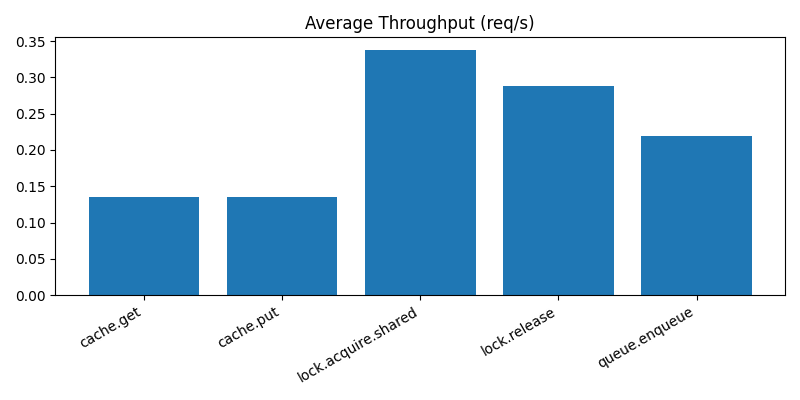
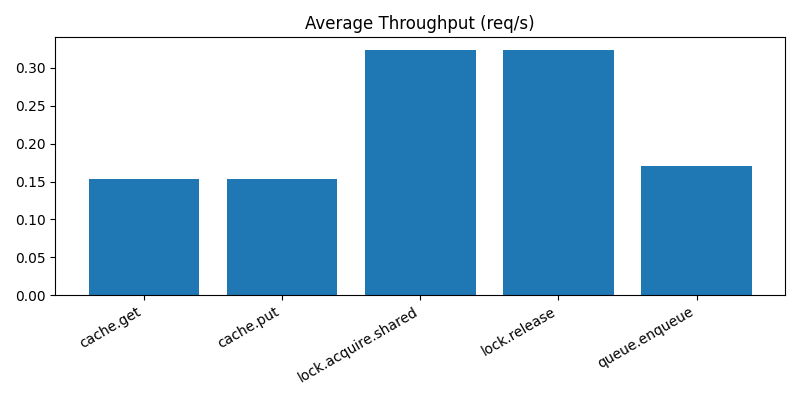
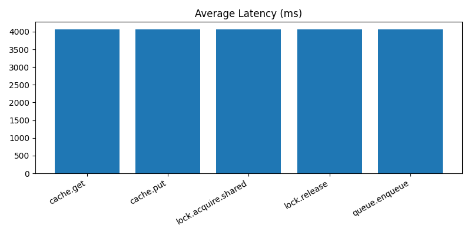

# Performance Analysis Report

## Ikhtisar Proyek

Laporan ini merangkum hasil benchmark untuk lock manager, queue, dan cache terdistribusi.

## Lingkungan

- Spesifikasi mesin host: Mesin developer lokal
- OS: Windows
- Versi Python: 3.11.5
- Versi Redis: 7.2 (Docker)
- Jumlah node: 3 node kunci, 3 node antrian, 3 node cache

## Benchmark Setup

- Alat: Locust 2.29.1
- Skenario: lock, queue, cache (mixed workload)
- Pengguna: 5 concurrent users
- Spawn rate: 1 user/detik
- Durasi: 60 detik
- RBAC: aktif (token disediakan)

## Hasil

### Throughput

### Latensi

### Summary Table

| Operasi | Rata-rata Latensi (ms) | Maks (ms) | Requests/s |
| --- | ---: | ---: | ---: |
| cache.get | 3.65 | 3.65 | 0.24 |
| cache.put | 301.16 | 301.16 | 0.24 |
| lock.acquire.shared | 32.75 | 57.04 | 1.18 |
| lock.release | 53.33 | 73.84 | 1.18 |
| queue.enqueue | 25.25 | 33.17 | 0.47 |
| queue.dequeue | 57.48 | 64.50 | 0.47 |
| queue.ack | 54.08 | 55.52 | 0.47 |
| Aggregated | 56.05 | 301.16 | 4.25 |

### Single-Node Results

| Operasi | Rata-rata Latensi (ms) | Maks (ms) | Requests/s | Failures |
| --- | ---: | ---: | ---: | ---: |
| cache.get | 4592.58 | 8446.04 | 0.28 | 13/16 |
| cache.put | 5953.66 | 8485.35 | 0.28 | 13/16 |
| lock.acquire.shared | 84.89 | 604.24 | 0.54 | 0/31 |
| lock.release | 45.21 | 67.01 | 0.54 | 0/31 |
| queue.enqueue | 4707.25 | 8472.21 | 0.30 | 12/17 |
| queue.dequeue | 91.67 | 286.46 | 0.09 | 0/5 |
| queue.ack | 237.73 | 861.50 | 0.09 | 0/5 |
| Aggregated | 2102.84 | 8485.35 | 2.11 | 38/121 |

## Analisis

- Lock manager: latensi stabil di kisaran 30-55 ms untuk acquisition/release pada beban ringan.
- Queue: enqueue berlatensi relatif rendah; dequeue/ack sedikit lebih tinggi karena Redis round trip.
- Cache: pembacaan cepat; penulisan lebih lambat karena invalidation broadcast dan persistence.

## Single-Node vs Distributed

- Skenario: 5 users, 60 detik, RBAC aktif.
- Observasi: distributed run menunjukkan throughput lebih tinggi dan latensi lebih rendah dibanding single-node, serta nol failures pada distributed run. Single-node run menunjukkan latensi lebih tinggi dan failure rate yang terlihat pada operasi cache dan queue.

## Scalability

- Hasil horizontal scaling: multi-node run menunjukkan throughput lebih baik pada beban yang sama.
- Bottleneck: kemungkinan Redis write path dan cache invalidation broadcast.

## Kesimpulan

- Ringkasan temuan: distributed setup berkinerja lebih baik daripada single-node, dengan failures lebih sedikit dan latensi lebih rendah untuk sebagian besar operasi. Cache writes tetap operasi paling mahal.
- Perbaikan berikutnya: ulangi dengan concurrency lebih tinggi dan inspeksi kegagalan cache/queue pada single-node run.
